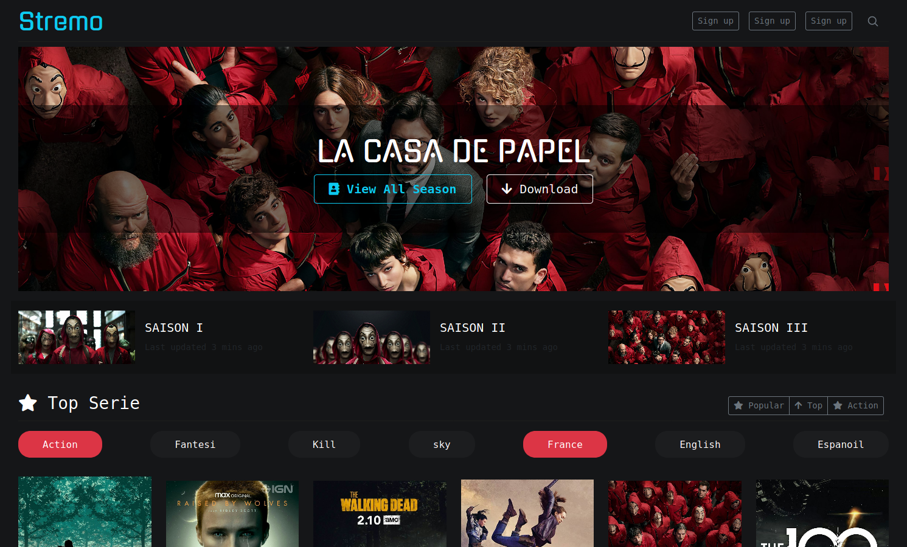

# Streming Video Web Template

This is My Progect, Littel webSite Streaming Video Films And Series Like Netflix . 
You can Use it, it free and OpenSource 
[ SORRY ABOUT THE ERROR ON ORTHOGRAPHE ]

### About Langage Programing

## Image Include
all image included about coverture of films or series, I am not the author about him . 
i just download it on the net, i dont know if it opensource or i can use it . (pleas verify source)

## License
Free OpenSource (just web site Not Incloud image)

## Folow Me @assamer

